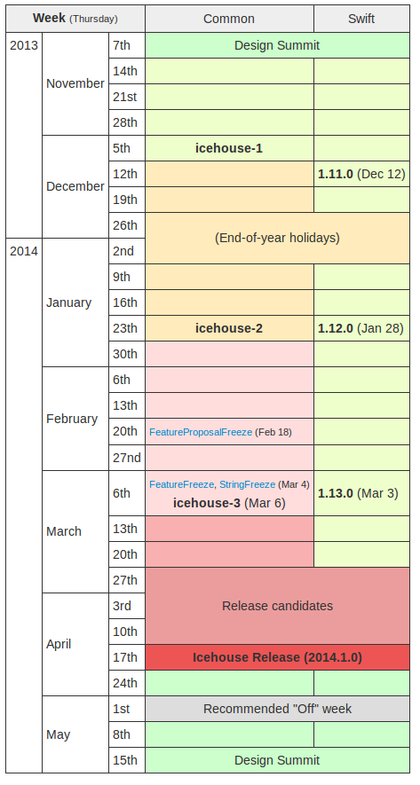

OpenStack Release Cycle
=======================

OpenStack Upstream Training
---------------------------

 <teacher name>
 <date>

----

Planning : Design
=================

.. class:: colleft
- Planning stage is at the start of a cycle
- take a step back
- focus on what we want to do for the next one

.. class:: colright

----

Planning : Discuss
==================

.. class:: colleft
- With our peers
- feedback and comments
- create the corresponding blueprint
- 4 weeks, Design Summit on the third week

.. class:: colright

----

Planning : Target
=================

.. class:: colleft
- file new blueprints and/or specs
- set a target milestone
- when in the cycle they intend to complete it
- PTLs triage the submitted blueprints and set priority

.. class:: colright

----

Implementation : Milestone
==========================

.. class:: colleft
- pushed to our Gerrit review
- weeks before the milestone publication date
- milestone-proposed branch
- feature-frozen

.. class:: colright

----

Implementation : freezes
========================

.. class:: colleft
- Feature freeze

  - new features will not be accepted, only fixes

- Feature proposal freeze

  - not even proposals for features will be accepted
  - read: focus on bug-fixing

- String freeze

  - all externally visible strings must be frozen
  - this helps the translation and documentation program

.. class:: colright

----

Release Candidates
==================

.. class:: colleft
- After the last milestone
- file bugs about everything you find
- prioritize bugs / bug triage
- write documentation
- fix as many bugs as you can

.. class:: colright

----

Release candidate 1
===================

.. class:: colleft
- Between the last milestone and the RC1
- stop adding features and concentrate on bug fixes
- Once all the release-critical bugs are fixed, we produce the first - - - release candidate for that project (RC1)
- used as-is as the final release

.. class:: colright

----

Other release candidates
========================

.. class:: colleft
- regressions and integration issues
- new release-critical bugs
- (RC2), with bugs targeted to it
- merged in the master branch first
- repeated as many times as necessary

.. class:: colright

----

Release day
===========

.. class:: colleft
- last published release candidate
- published collectively as the OpenStack release

.. class:: colright

----

Exercise
========

Based on the Icehouse release schedule, find the URL of a document or a patch that belongs to each of the steps.
