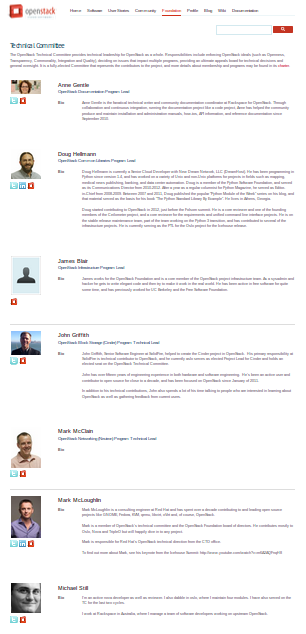

OpenStack Technical Committee
=============================

OpenStack Upstream Training
---------------------------

 <teacher name>
 <date>

----

Technical Committee
===================

The role of the Technical Committee

The Technical Committee ("TC") is tasked with providing the technical leadership for OpenStack as a whole (all official programs, as defined below). It enforces OpenStack ideals (Openness, Transparency, Commonality, Integration, Quality...), decides on issues affecting multiple programs, forms an ultimate appeals board for technical decisions, and generally has oversight over all the OpenStack project. 

----

OpenStack Programs
==================

`OpenStack "Programs" are efforts which are essential to the completion of the OpenStack project mission, which is to produce the ubiquitous Open Source Cloud Computing platform that will meet the needs of public and private clouds regardless of size, by being simple to implement and massively scalable. Programs can create any code repository and produce any deliverable they deem necessary to achieve their goals.`

----

List of Programs
================

- Compute (Nova)
- Object Storage (Swift)
- Image Service (Glance)
- Identity (Keystone)
- Dashboard (Horizon)
- Networking (Neutron)
- Block Storage (Cinder)
- Telemetry (Ceilometer)
- Orchestration (Heat)
- Database Service (Trove)
- Bare metal (Ironic)
- Common Libraries (Oslo)
- Queue service (Zaqar)
- Data processing (Sahara)
- Key management (Barbican)
- DNS Service (Designate)
- Shared File Systems (Manila)
- Infrastructure
- Documentation
- Quality Assurance (QA)
- Deployment (TripleO)
- Devstack (DevStack)
- Release cycle management

Maintained on http://git.openstack.org/cgit/openstack/governance/tree/reference/programs.yaml

----

Meetings
========

- Governance/TechnicalCommittee#Meeting
- Agenda
- Motions

.. image:: ./_assets/03-02-IRCmeeting.png

----

Exercise
========

- Exercise 
 - read tc.2014-04-01-20.03.log.html and briefly comment on keystone document

----

Program Technical Leads (PTLs)
==============================

- manage day-to-day operations
- drive the program goals
- resolve technical disputes

----

Active Program Contributor (APC)
=================================

- Voters for a given program PTL
- Subset of the Foundation Individual Member
- Committed a change over the last two 6-month
- Candidacy for the corresponding program PTL election

----

Active Technical Contributor (ATC)
======================================

`The TC seats are elected by the Active Technical Contributors ("ATC"), which are a subset of the Foundation Individual Members. Individual Members who committed a change to a repository under any of the official OpenStack programs (as defined above) over the last two 6-month release cycles are automatically considered ATC.`

- TC seats are elected by ATC
- Same as APC
- Bug triagers, technical documentation writers, etc can exceptionally apply for ATC

----

Exercise
========

`Each APC / ATC in the class add a URL to the etherpad proving it`
