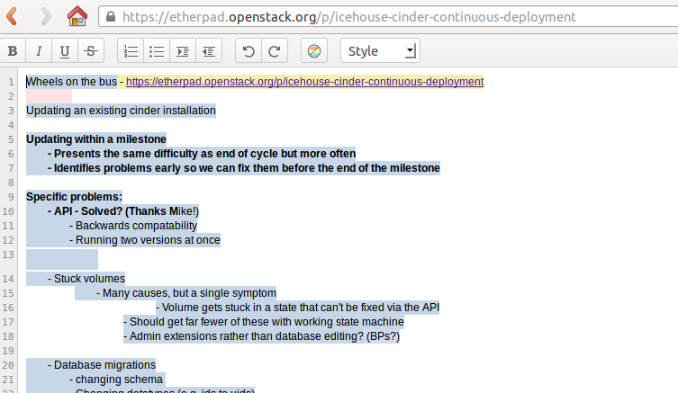
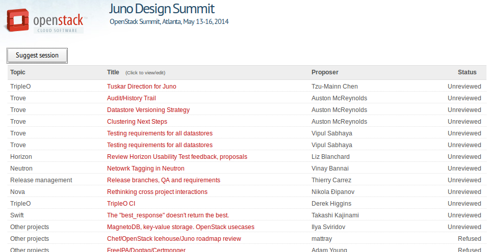

OpenStack Design Summit
=======================

OpenStack Upstream Training
---------------------------

 <teacher name>
 <date>

----

Design Summit
=============

Where developers meet face to face to finalize planning for the next release cycle.

.. image:: ./_assets/05-01-design-summit.png

----

How does it work?
==================

- Not a classic conference
- Discuss upcoming features for the next release cycle
- 40-min long sessions
- Open brainstorming discussion

----

.. image:: ./_assets/05-02-design-summit.png

----

Etherpads
=========

----

Proposing a session
===================

.. image:: ./_assets/05-04-sessions.png

----

List of sessions
================

----

Selection of sessions
=====================

- #Scheduled#: Your suggestion was accepted and has been scheduled
- #Preapproved#: Your suggestion was accepted and should be scheduled (or merged with another session) soon
- #Incomplete#: Your suggestion needs to be fixed before it can be accepted, please address reviewers comments
- #Refused#: Your suggestion has been rejected, see reviewers comments for an explanation

----

At the Design Summit
====================

- Start on time
- Mind the noise
- Clear introductions
- Keep the discussion lively and on-topic
- End on time

----

Exercise
========

- Add a session proposal regarding your contribution in an etherpad
- Review two proposals

----

Rendezvous
===========

`Summit 101` sessions
