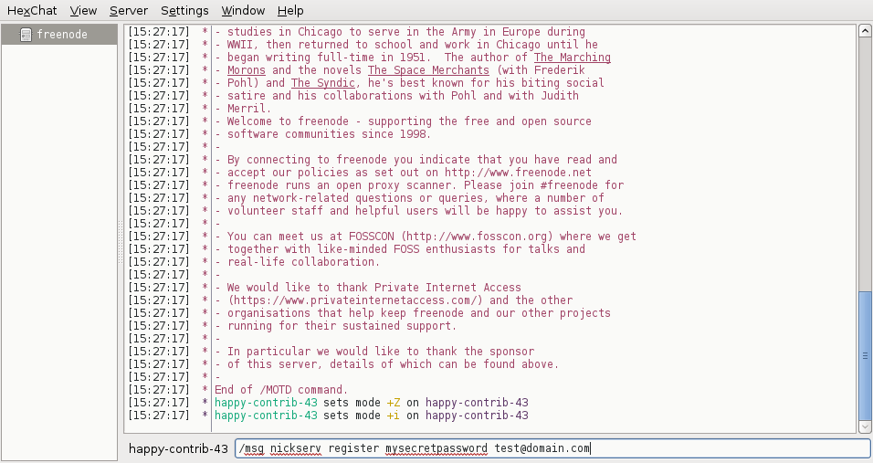
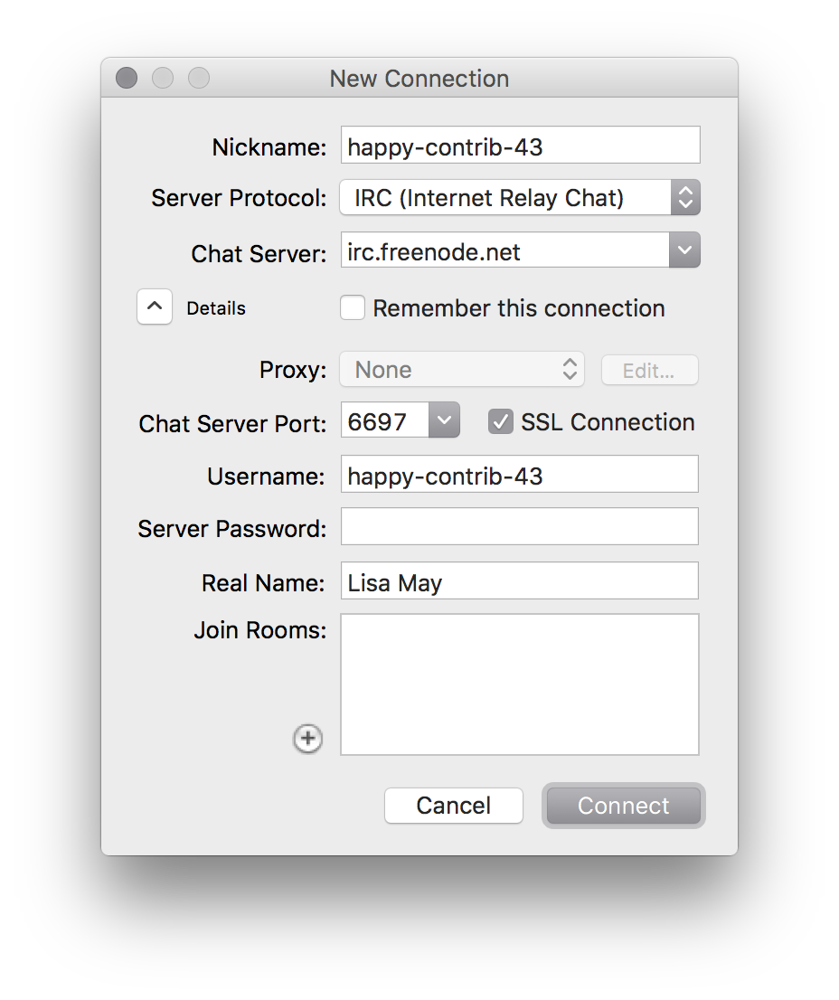
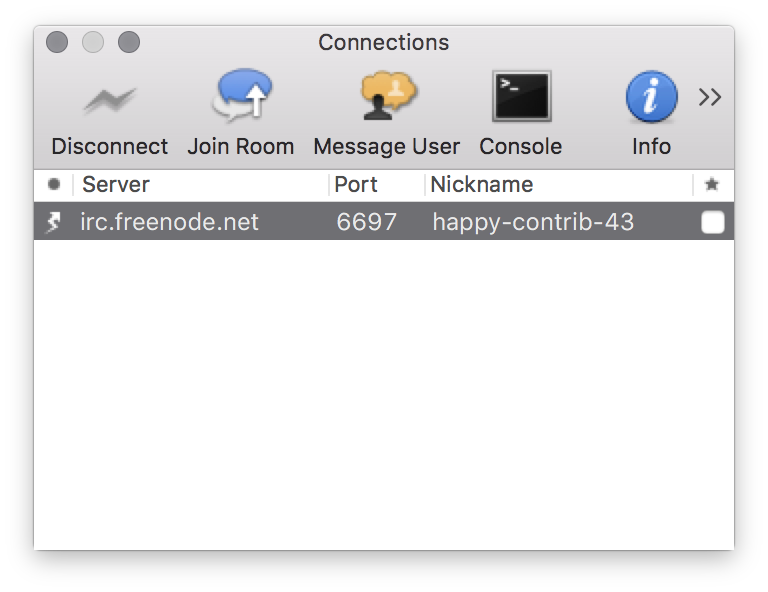
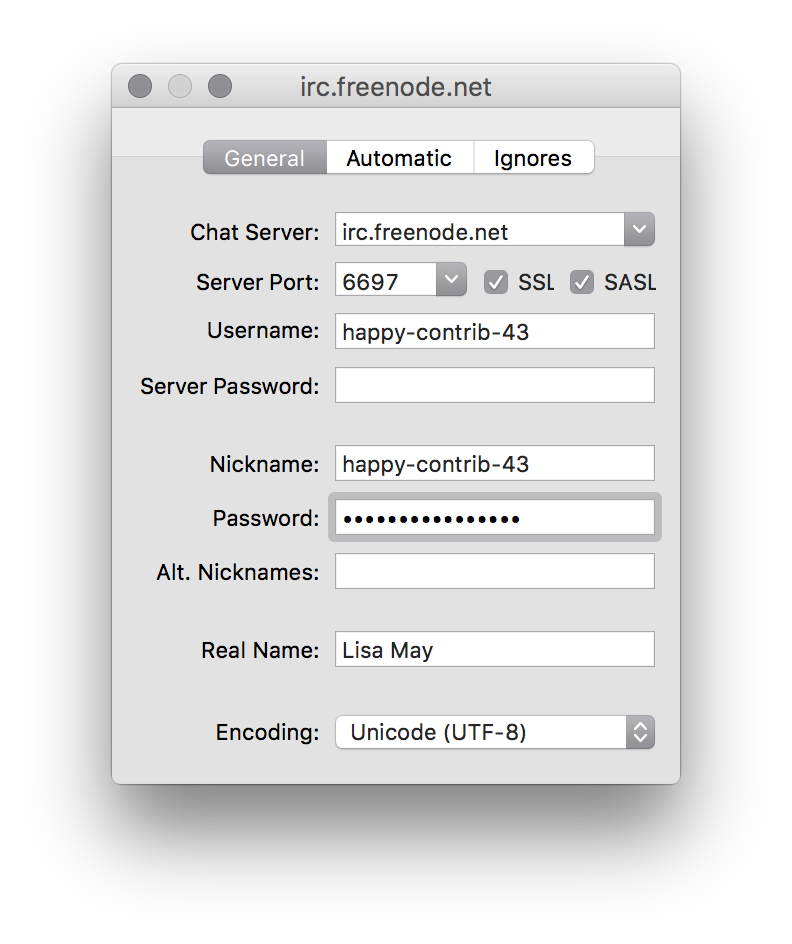

#########
Setup IRC
#########

Linux
======

Install an IRC Program
----------------------
We'll install an IRC program called Hexchat.

For a linux distrubtions like Debian, Ubuntu, or Mint open a terminal and
type::

  sudo apt-get install hexchat

For a linux distrubtions like Redhat, Fedora 21 or earlier, or Centos open
a terminal and type::

  sudo yum install hexchat

For Fedora 22 or later open a terminal and type::

  sudo dnf install hexchat

Now open the hexchat program just like you would for any linux program.

Edit Nick Name Settings
-----------------------
#. Lets first fill out the **Nick name** and **User name** field with our
   choice of a nickname:
#. From the list of **Networks** you should see Freenode. Select that and click
   'edit'.

.. image:: ./source/_assets/tools/irc/linux/1.png

Edit Server Settings
--------------------
#. Click the **edit** button and
#. Make sure that **Use SSL for all the servers on this network** is
   checked.

.. image:: ./source/_assets/tools/irc/linux/2.png

Troubleshooting
^^^^^^^^^^^^^^^
* If you get a notice that the nick name is already taken, quit and go back to
  the first set of steps to pick a different nickname.

Register Your Nick Name
-----------------------
If all goes well we should get a dialog window indicating the connection to
freenode has completed, and what to do next.. For now we'll select "Nothing,
I'll join a channel later."

.. image:: ./source/_assets/tools/irc/linux/3.png

When you login to the server for the first time with your nickname, its being
used by you, but it's still not registered yet.

In order to register we need to send a message to nickserv on freenode, which
is a bot that allows us to register and identify ourselves as the owner of
a nick name.

Type the following to register your nick name with nickserv replacing
**mysecretpassword** and **test@domain.com** with your own password and email
address::

  /msg nickserv register mysecretpassword test@domain.com

If all goes well you should receive a message back instantly that the nick name
is registered by you and an activation email will be sent to the email address
you provided.

Auto-Login On Connecting To Freenode
------------------------------------
In order to identify ourselves that we own the nick name upon logging in, we
need to tell Hexchat to communicate our password over upon connecting.

#. Click **Hexchat** from the menu and then click **Network List**. We will see
   a familiar first screen of servers listed. Make sure freenode is highlighted
   and click **edit**.
#. In the **Password** put in the password we picked in the previous
   step and click close.

.. image:: ./source/_assets/tools/irc/linux/5.png

Done
----
Congratulations you're now ready to communicate with the OpenStack community
and have a registered nick name on Freenode! From here on out when you connect
to Freenode with Hexchat you will be identified with your nickname.

Mac OS
======

Install an IRC Program
----------------------
We'll install an IRC program called Colloquy.

#. Go to http://colloquy.info and follow the download link.
#. From your downloads folder, drag the Colloquy application icon to your
   applications folder to install.

Add A New Connection
--------------------
#. Lets first fill out the **Nickname** and **User name** field with our
   choice of a nickname:
#. For the **Chat server** type in **irc.freenode.net**.
#. For the **Chat Server Port** type in **6697** and check the **SSL
   Connection** box.

If all goes well in the second window we should see our our new connection and
our client connected.

Troubleshooting
^^^^^^^^^^^^^^^
* If you get a notice that the nick name is already taken
    * Click **cancel**.
    * Click the **info** icon.
    * Type in a different user/nick name as shown in the previous step.
    * Click **disconnect** and click **connect** to retry connecting with the
      new nick name.

.. image:: ./source/_assets/tools/irc/macos/3.png
    :width: 50%

Register Your Nick Name
-----------------------
If all goes well we should be connected and no pop ups as indicted in the
previous step's Troubleshooting section.

When you login to the server for the first time with your nickname, its being
used by you, but it's still not registered yet.

In order to register we need to send a message to nickserv on freenode, which
is a bot that allows us to register and identify ourselves as the owner of
a nick name.

Click the **message user** icon and type::

  nickserv

A message dialog window will come up. Type the following to register your nick
name with nickserv replacing **mysecretpassword** and **test@domain.com** with
your own password and email address::

  register mysecretpassword test@domain.com

.. image:: ./source/_assets/tools/irc/macos/4.png
    :width: 90%

If all goes well you should receive a message back instantly that the nick name
is registered by you and an activation email will be sent to the email address
you provided.

Auto-Login On Connecting To Freenode
------------------------------------
In order to identify ourselves that we own the nick name upon logging in, we
need to tell Colloquy to communicate our password over upon connecting.

#. Going back to your connection window, highlight your freenode connection and
   click the **info** icon.
#. In the **Password** field type your password.

Done
----
Congratulations you're now ready to communicate with the OpenStack community
and have a registered nick name on Freenode! From here on out when you connect
to Freenode with Colloquy you will be identified with your nickname.
