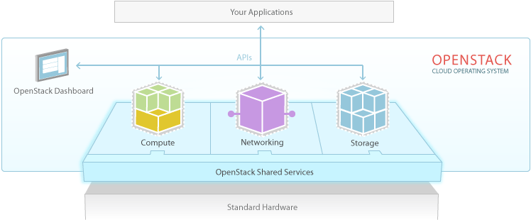
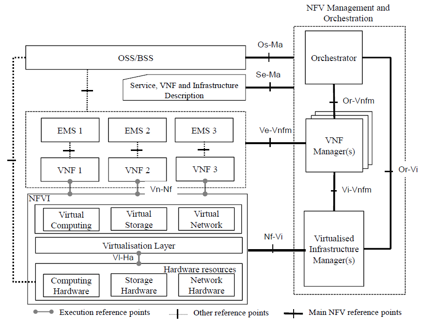

=====================
OpenStack as Software
=====================

.. image:: ./_assets/os_background.png
   :class: fill
   :width: 100%

OpenStack
=========

- Software package that provides a cloud platform for

  - Public/Private cloud
  - Various use cases including Enterprise/Telecom/etc.

- Infrastructure as a Service (IaaS)
- Additional services built upon IaaS

The OpenStack Package
=====================

- Flexibility

  - Core services (Compute, Networking, Block and Object Storage, etc.)
  - Building Blocks: build as you need

- REST APIs
- Software Development Kits (SDKs)
- Documentation
- Packaging
- Distributions

OpenStack from Telecom/NFV perspective
======================================

- NFV = Network Function Virtualisation

OpenStack from Telecom/NFV perspective
======================================

- Virtual Infrastructure Manager (VIM) + NFV Infratsructure (NFVI)

  - Most of the OpenStack Services

- Virtual Network Functions Manager (VNFM)

  - Heat
  - Murano
  - Mistral
