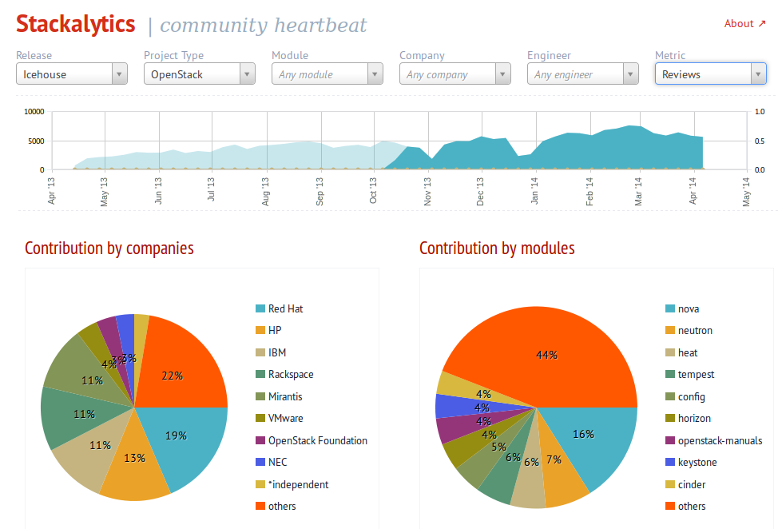
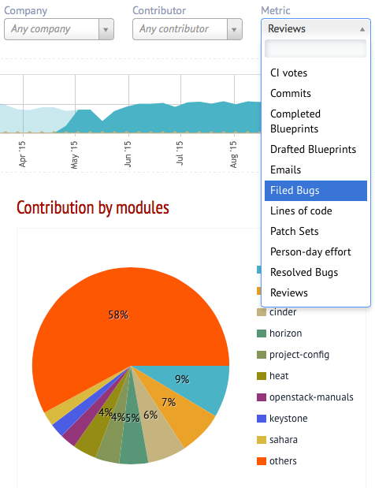
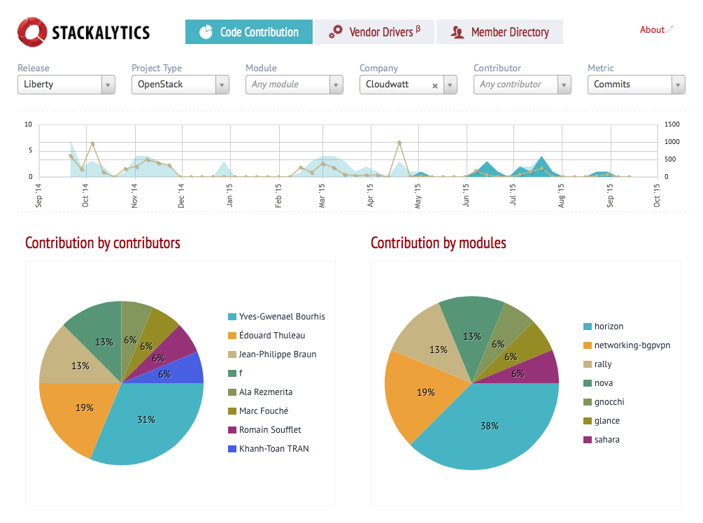
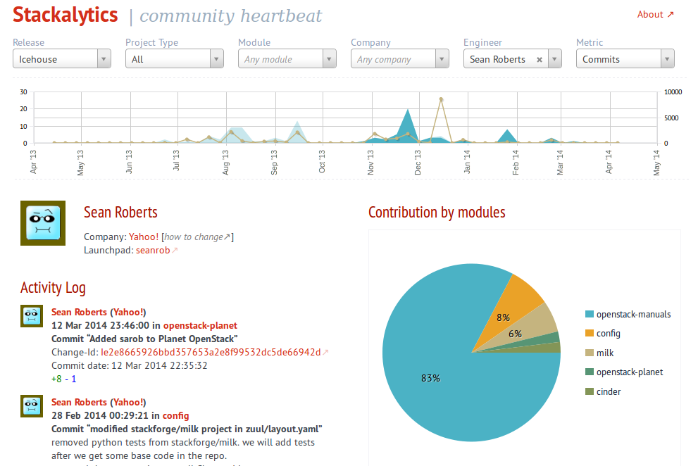
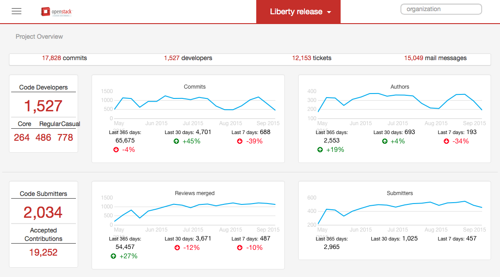
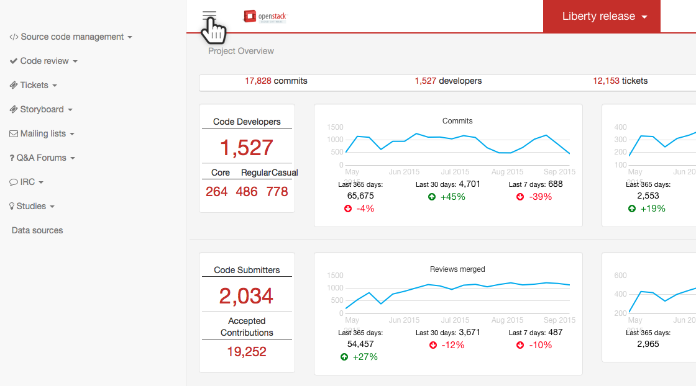

===============
Relevant actors
===============

.. image:: ./_assets/os_background.png
   :class: fill
   :width: 100%

The OpenStack Community
=======================

- Created by a large growing community

  - 24,000 people
  - 495 supporting companies
  - over 20 million lines of code

- Most recent ("Kilo") release stats:

  - 1,500 developers
  - 170 different companies
  - 20,000 patches

Relevant actors
===============

Relevance metrics
=================

.. rst-class:: colleft

- CI votes
- Commits
- Completed Blueprints
- Drafted Blueprints
- Emails
- Filed Bugs
- Lines of code
- Patch Sets
- Person-day effort
- Resolved Bugs
- Reviews

.. rst-class:: colright

Company snapshot
================

Individual snapshot
===================

Module contributors
===================

.. image:: ./_assets/02-05-module-contributors.png
  :width: 95%

OpenStack Activity - Dashboard
==============================

activity.openstack.org

OpenStack Activity - Other Metrics
==================================

activity.openstack.org

Your management
===============

Exercise
========

List three companies and individuals that have been the most influential in
the making of the module you plan to contribute to, for each metric value.
