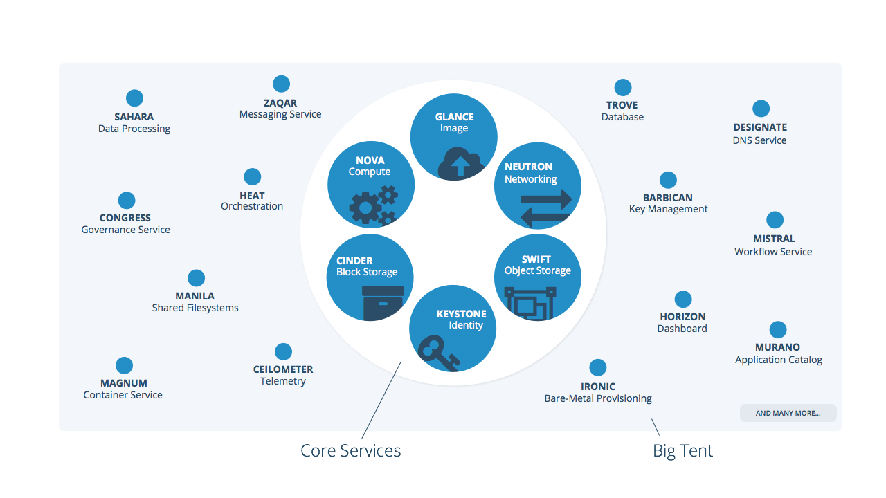

===========================
Official OpenStack projects
===========================

.. image:: ./_assets/os_background.png
   :class: fill
   :width: 100%

OpenStack Project Teams
=======================
- The building blocks to achieve OpenStack's mission
- Using the same tools (code repository, bug tracker, etc) and coordinated
  processes to produce a number of deliverables
- Teams in OpenStack can be freely created as they are needed
- Teams of official projects are under the authority of the Technical Commitee

Official OpenStack projects
===========================
- Official OpenStack projects have to  fullfill the requirements of official
  OpenStack projects
- Projects are evolving themselves and also sustain for one collaborative
  framework, OpenStack

 - Projects APIs are documented within the project
 - Testable on its own
 - Dashboard (horizon) and DevStack provide plugin interface for easy
   integration

- Big Tent is a code name for the official OpenStack projects

Benefits of being an Official OpenStack project
===============================================
 - Contributors of an OpenStack project

  - Get to vote in the Technical Commitee election
  - Can publish to docs.openstack.org and developer.openstack.org
  - Get space on OpenStack Summits and Project Team Gatherings (PTG)

 .. note::

  - PTG: https://www.openstack.org/ptg/

Benefits of being an Official OpenStack project
===============================================
   - Contributors of an OpenStack project

    - Get marketing from the OpenStack Foundation
    - Get access to Foundation programs, like mentoring and internship to help
      with on boarding
    - Get guidance from community members and leaders

Requirements of Official OpenStack projects
===========================================
 - Align with the OpenStack Mission and follow the OpenStack way, the four
   opens
 - Ensure basic interoperability with the rest of OpenStack
 - Have an active team of one or more contributors
 - Participate in any goals specified by the TC, as defined by OpenStack-wide
   Goals
 - Meet any policies that the TC requires from all projects
 - Submit to the TC oversight
 - It is the projects decision to follow the OpenStack release

.. note::

 - Requirements
   (http://governance.openstack.org/reference/new-projects-requirements.html)
 - Mission (https://wiki.openstack.org/wiki/Main_Page)
 - Goals (http://governance.openstack.org/goals/index.html#release-cycle-goals)

 - A project is aligned with the OpenStack Mission if

  - have a clear and defined scope.
  - provides a cloud infrastructure service or should directly build on an
    existing OpenStack cloud infrastructure service

 - The four opens

  - http://governance.openstack.org/reference/opens.html
  - http://governance.openstack.org/reference/new-projects-requirements.html

 - ensures basic interoperability with the rest of OpenStack: User-facing API
   services should support Keystone for discovery and authentication

Core and Optional Services
==========================
- Core services are OpenStack projects and essential in every OpenStack-powered
  IaaS cloud or product
- Optional services are also OpenStack projects but not necessarily need to
  operate OpenStack depending on use cases

.. note::
 - Full list of Official OpenStack projects:
   http://governance.openstack.org/reference/tags/type_service.html#tag-type-service
 - All projects: http://governance.openstack.org/reference/projects/index.html

Core and Optional Services
==========================

Tags describing OpenStack Projects
==================================
- Describe the output produced by the OpenStack community teams

  - About software, documentation, release management etc
  - How projects are released
  - Team diversity
  - ...

- Tags can be proposed by anyone

  - List of approved tags
  - http://governance.openstack.org/reference/tags/index.html

DefCore (or what cloud can be labeled as OpenStack)
===================================================
.. image:: ./_assets/04-02-defcore.png
  :align: center

- "Guiding principles" used by the Foundation Board to determine how commercial
  implementations of OpenStack can be granted use of the trademark

.. note::

 - Implementations that are Core can use OpenStack trademark
   (OpenStack™)
 - The Implementation is a subset of the whole project
 - Claiming OpenStack requiring use of designated upstream code
 - The Implementation must have an open reference implementation
 - Vendors may substitute alternate implementations
 - Tests can be remotely or self-administered
 - A subset of tests are chosen by the Foundation as "must-pass"
 - Being OpenStack Core Implementation means passing all "must-pass" tests

Exercise
========

What kind of project do you want to contribute to?
