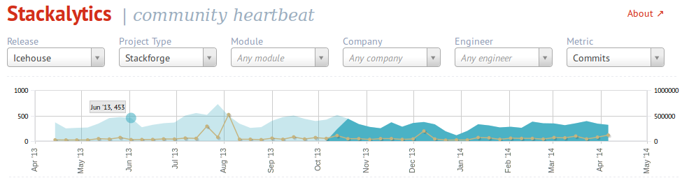

===========================
OpenStack Program Ecosystem
===========================

.. rst-class:: colright

|  <teacher name>
|  <date>

Lifecycle of a new Program
==========================

.. image:: ./_assets/04-01-lifecycle1.png
  :width: 100%

External
========

.. image:: ./_assets/04-02-lifecycle.png
  :width: 100%

- Idea
- Gather a community
- Alternate implementations
- Stackforge
- File an OpenStack incubation request

Incubated
=========

.. image:: ./_assets/04-03-lifecycle.png
  :width: 100%

- Fill the gap with graduation requirements
- Align with the OpenStack way
- Two development milestones
- Migrate to the openstack/* namespace
- Graduation review

Integrated
==========

.. image:: ./_assets/04-04-lifecycle.png
  :width: 100%

- Cannot graduate in the middle of a cycle
- Follow a full cycle as an integrated project

Core (or What is OpenStack)
===========================

- DefCore initiative, sponsored by the Board of Directors
- Currently work in progress for qualifying APIs

Stackforge
==========

.. image:: ./_assets/04-05-stackforge.png
  :width: 100%

- Gerrit code review
- Jenkins continuous integration
- Git repository
- IRC bots, pypi uploads...

What is Stackforge for
======================

- Maintain related unofficial projects
- Same tools and procedures used by the main projects

How to add a project to Stackforge
==================================

.. image:: ./_assets/04-07-stackforge.png
  :width: 100%

Exercise
========

What kind of program do you want to contribute to?
