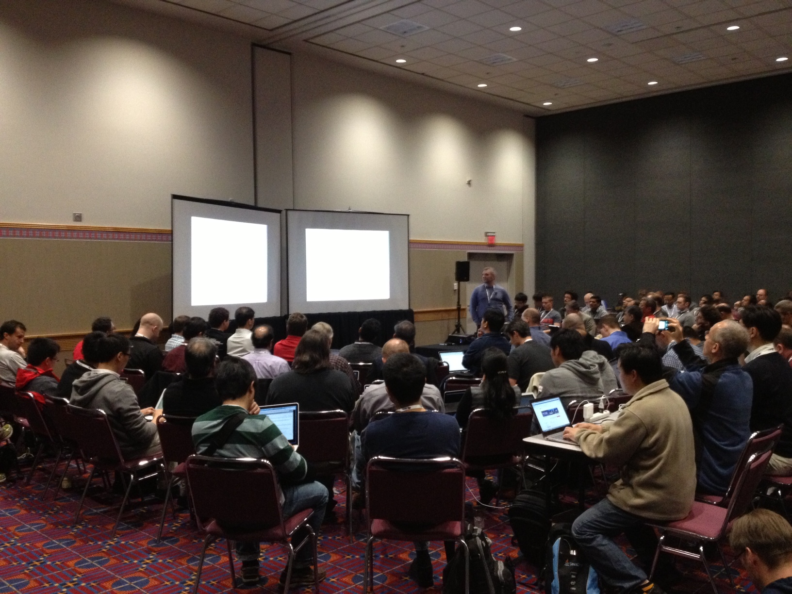

=======================
OpenStack Design Summit
=======================

.. rst-class:: colright

|  <teacher name>
|  <date>

OpenStack Design Summit
=======================

Where developers meet face to face to finalize planning for the next release
cycle.

.. image:: ./_assets/05-01-design-summit.png

How does it work?
==================

- Not a classic conference
- Discuss upcoming features for the next release cycle
- 40-min long sessions
- Open brainstorming discussion

Etherpads
=========

.. image:: ./_assets/05-03-etherpads.png

Proposing a session
===================

- https://wiki.openstack.org/wiki/Summit/Kilo

List of sessions (formerly)
===========================

.. image:: ./_assets/05-05-sessions.png

Selection of sessions
=====================

- TC votes for sessions in cross-project and other-projects tracks
- PTLs vote for sessions in project tracks

At the Design Summit
====================

- Start on time
- Mind the noise
- Clear introductions
- Keep the discussion lively and on-topic
- End on time

Exercise
========

- Add a session proposal regarding your contribution in an etherpad
- Review two proposals

Rendezvous
===========

`Summit 101` sessions
