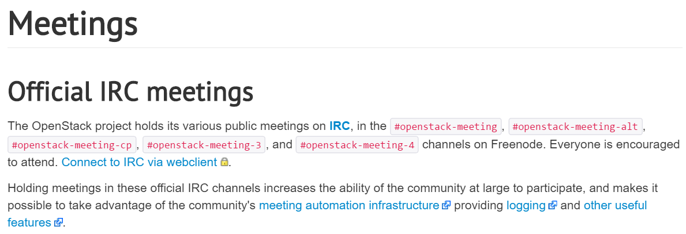
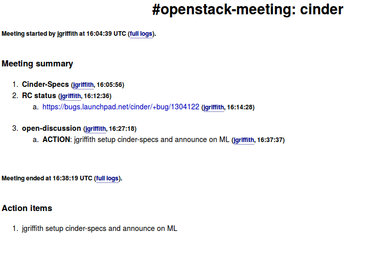

============
IRC meetings
============

.. image:: ./_assets/os_background.png
   :class: fill
   :width: 100%

IRC meetings
============

.. image:: ./_assets/06-01-irc-meetings.png
  :width: 100%

IRC meetings list
=================

Meeting agenda
==============

.. image:: ./_assets/06-03-meeting-agenda.png
  :width: 100%

Meetbot
=======

Exercise
========

Join irc.freenode.net#upstream-university

#info
=====

Add an info item to the minutes. People should liberally use this for
important things they say, so that they can be logged in the minutes.

#action
=======

Document an action item in the minutes. Include any nicknames in the line, and
the item will be assigned to them. (nicknames are case-sensitive)

#help
=====

Add a "Call for Help" to the minutes. Use this command when you need to
recruit someone to do a task. (Counter-intuitively, this doesn't provide help
on the bot)

Exercise
========

Lunch menu meeting
