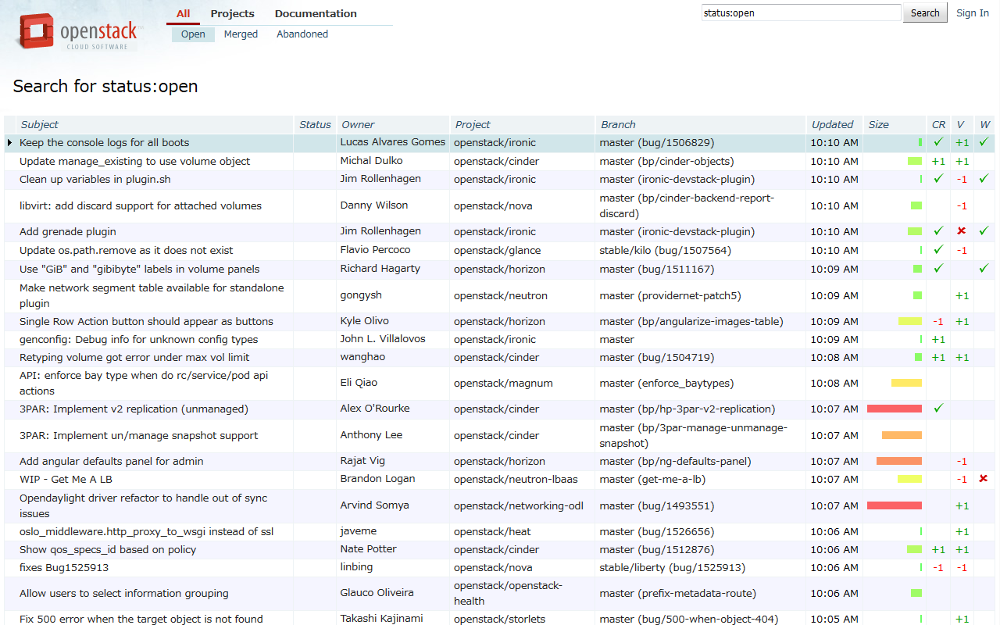
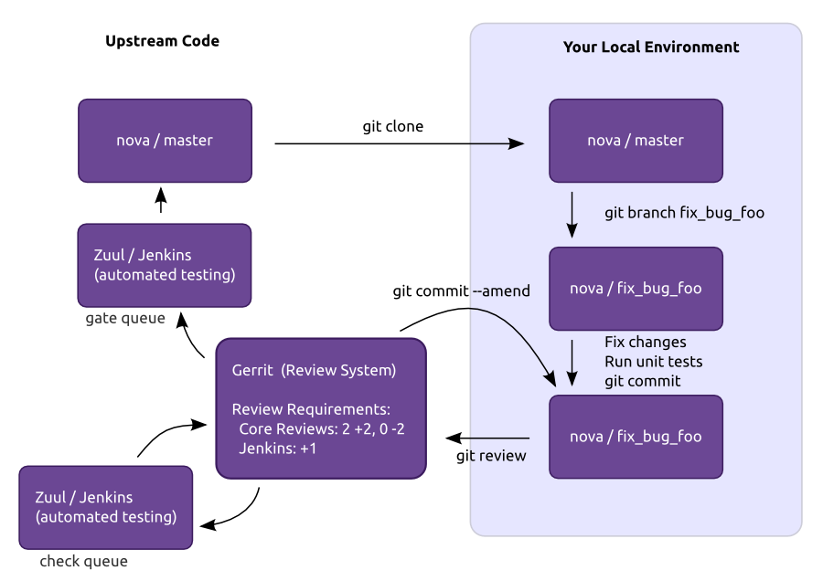
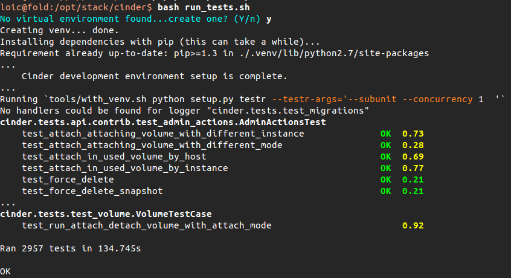
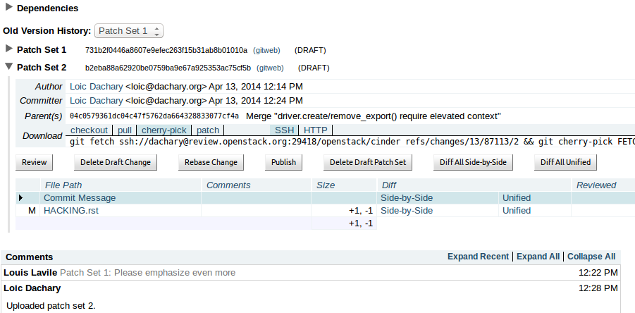
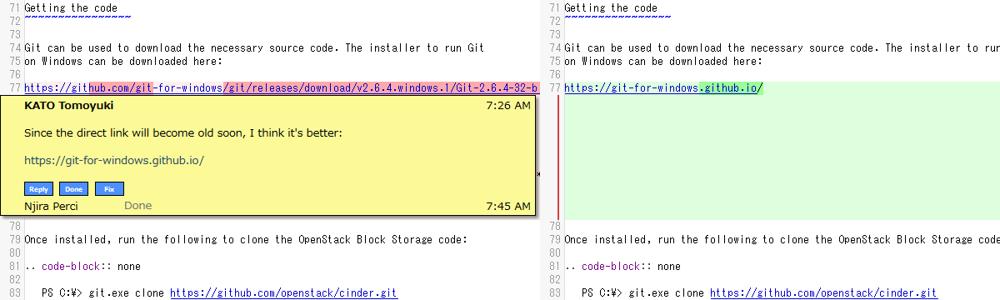

====================
review.openstack.org
====================

.. image:: ./_assets/os_background.png
   :class: fill
   :width: 100%

review.openstack.org
====================

gerrit workflow
===============

upload an ssh key
=================

- https://review.openstack.org/#/settings/ssh-keys

.. image:: ./_assets/14-03-upload-ssh-key.png
   :width: 85%

git config
==========

- git config --global user.name "Firstname Lastname"
- git config --global user.email "your_email@youremail.com"

.. image:: ./_assets/14-04-git-config.png

Install git review
==================

- apt / yum / pip install … git review

.. image:: ./_assets/14-05-install.png

git clone
=========

.. image:: ./_assets/14-06-git-clone.png

git review -s
=============

.. image:: ./_assets/14-07-git-review-s.png

git checkout -b TOPIC-BRANCH
============================

.. image:: ./_assets/14-08-git-checkout.png

running unit tests
==================

invite reviewers
================

.. image:: ./_assets/14-11-invite-reviewers.png
  :width: 100%

git commit --amend
==================

.. image:: ./_assets/14-13-git-commit-amend.png

gerrit patchset history
=======================

patchset diffs
==============

Exercise
========

Push a work in progress (wip) and invite reviewers.
