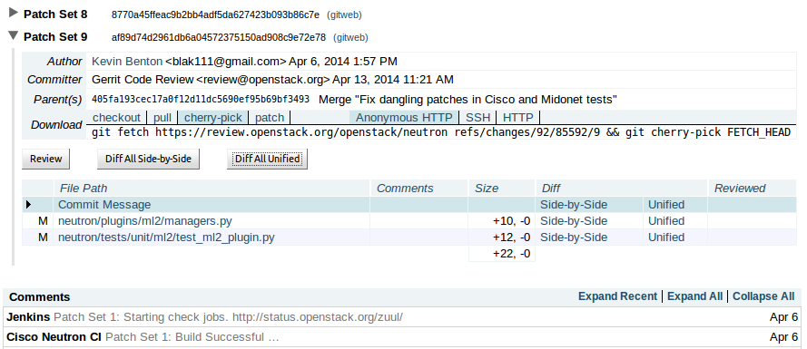
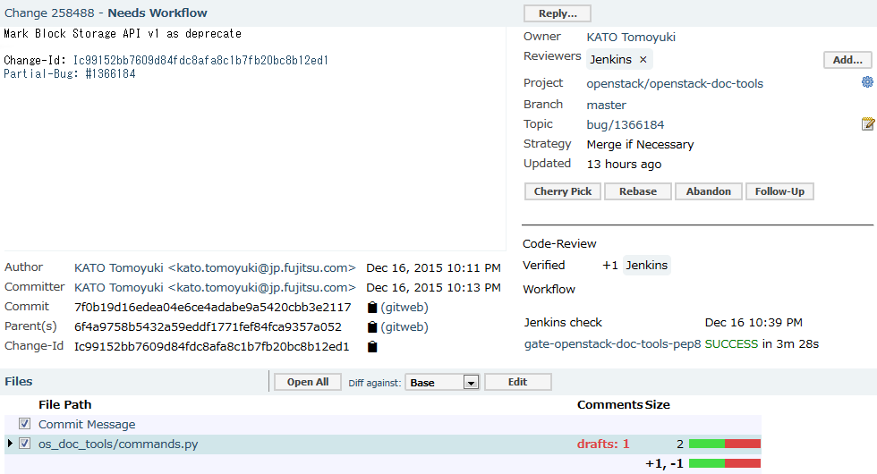
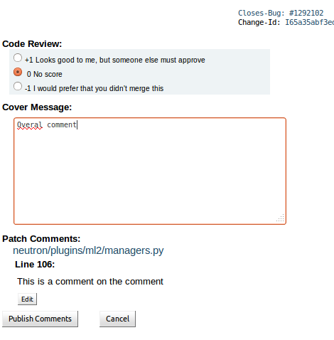
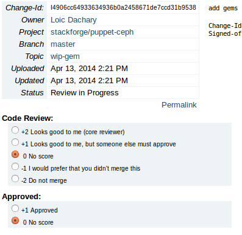

=========
Reviewing
=========

.. image:: ./_assets/os_background.png
   :class: fill
   :width: 100%

Review unified
==============

Inline comments
===============

.. image:: ./_assets/16-03-inline-comments.png

Draft inline comments
=====================

Regular reviewer
================

Core reviewer
=============

Exercise
========

Review three patches in the sandbox environment. Try to find things to make
comments on even if they are just asking a question and not pointing out an
issue, don't just +1 three different patches.
