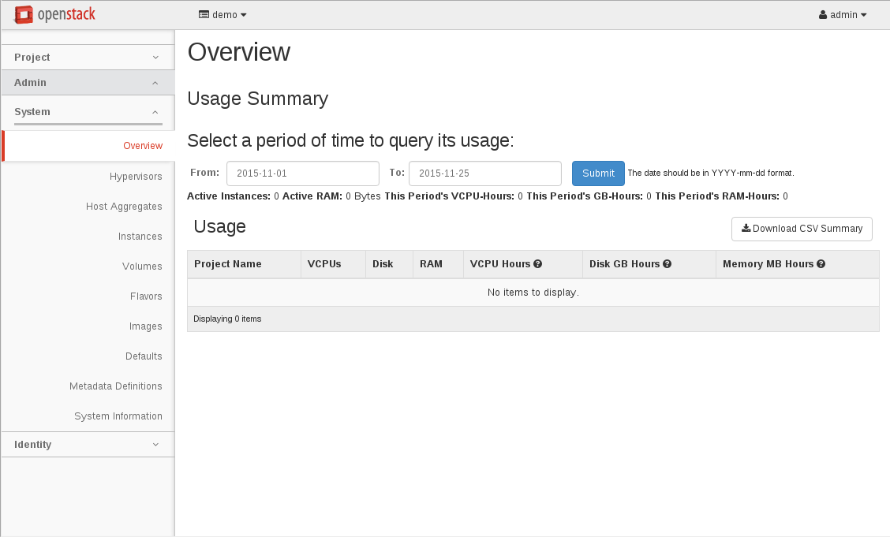
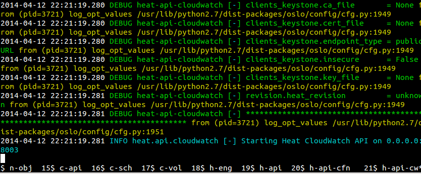

================
Demo environment
================

.. image:: ./_assets/os_background.png
   :class: fill
   :width: 100%

DevStack
========

- A bunch of scripts to build a full OpenStack environment
- Used as

  - Demo environment
  - Part of the OpenStack project's functional testing

- Single and multi node setup
- Installs services from source

  - from git master by default
  - from stable branches by configuration, e.g. stable/newton

- Documentation: https://docs.openstack.org/developer/devstack/

DevStack Clone and Setup
========================
- Clone DevStack to your vm

.. code-block:: console

  git clone https://git.openstack.org/openstack-dev/devstack

- Make any local configurations changes (set passwords, IP addresses, etc.)

.. code-block:: console

  cd ./devstack
  cp ./samples/local.conf .
  nano ./local.conf

.. note::

  - Students can use a different editor instead of nano with their own
    preferences (e.g. vi, emacs, or whatever they want).

- Run DevStack

.. code-block:: console

  ./stack.sh

.. note::

  - DevStack should already be installed in the VM image you downloaded.
    These instructions are provided for future reference in the case that
    students need to start from scratch.

http://localhost/
=================

- After DevStack is run Horizon is accessible via localhost

Running services in DevStack
============================

- ``screen`` command was used to access the virtual terminals running the
  installed services

  - ``screen`` use is now deprecated
  - To use ``screen`` explicitly set ``USE_SCREEN=True`` option in
    ``local.conf``

- More details: `Developing with Devstack <https://docs.openstack.org/developer/devstack/development.html>`_

.. note::

  - Screen is going away in Queens
    : http://lists.openstack.org/pipermail/openstack-dev/2017-May/116301.html

  - Useful screen commands:

    - List sessions: screen -ls
    - Connect: screen -R <session name>
    - Start a new session:  screen -C devstack/stack-screenrc
    - Move between services: <ctrl>-a n , <ctrl>-a p
    - Kill and restart a service: <ctrl>-c , <up arrow> to retrieve command
    - Disconnect: <ctrl>-a d

DevStack services with Systemd
==============================

- ``systemd`` is the replacement for ``screen``
- Services in DevStack are running as ``systemd`` units named
  devstack@$servicename.service
- Interact with services using commands like
  ``sudo systemctl <start|stop|restart> devstack@$servicename.service``
- Follow logs with ``journalctl -f --unit devstack@$servicename.service``
- More details: `Using Systemd in DevStack <https://docs.openstack.org/developer/devstack/systemd.html>`_

Exercise
========

- Ensure you have the DevStack repository cloned to the VM where you
  would like to use it
- Use ``systemctl status devstack@*`` to ensure devstack is running on your VM.
  If it is not started, start it with ``systemctl start devstack@*``
- Use the ``journalctl`` command to view output from your favorite service
- Ensure you can use the ``openstack`` command to interact with the services
  running on your VM
