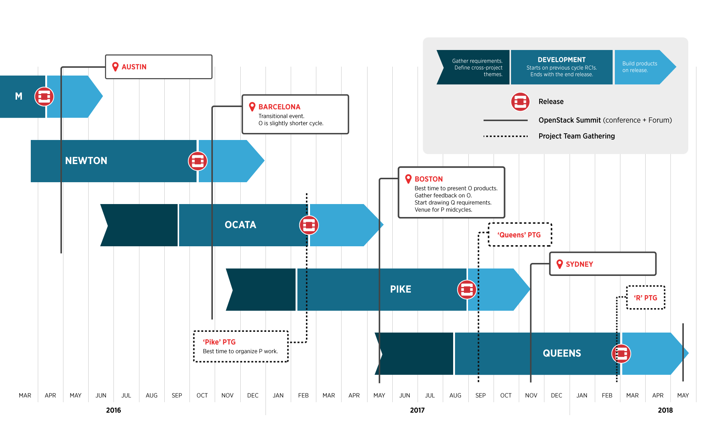

================
OpenStack Events
================

.. image:: ./_assets/os_background.png
   :class: fill
   :width: 100%

Regional Events
===============

- OpenStack Days
- OpenStack Birthday Celebration
- User Group Meetups

OpenStack Days
==============

- Regional 'Mini-Summit'
- Hosted annually by local OpenStack User Groups and companies
- Endorsed by the Foundation
- Growing in number (26 in 2016)

Exercise 1
==========

- Look up an OpenStack Days event close to where you live that you would be
  interested in attending

OpenStack Birthday Celebration
==============================

- Held by local groups to celebrate another year of OpenStack
- 2016 was 6th birthday of OpenStack

User Group Meetups
==================

- Smaller scale than OpenStack Days Events
- Some are more development focused while others are more user and
  ops focused
- https://groups.openstack.org/

Global Events and Releases
==========================

Project Team Gathering (PTG)
============================

- A gathering of projects teams and contributors
- Dedicated and detailed technical discussions
- Useful for participants if they are already working with a
  project team
- Not good as an entry point

.. note
   http://www.openstack.org/ptg
   http://www.openstack.org/ptg/ptgfaq/

Exercise 2
==========

- Look up the location and dates of the first PTG

OpenStack Design Summit
=======================

Where developers meet face to face to finalize planning for the next release
cycle.

.. image:: ./_assets/05-01-design-summit.png

.. note
   This format is being deprecated and this Summit is the last where this will
   be the format.

How does it work?
=================

- Not a classic conference with presenter and audience

  - more like a collaborative brainstorming session

- Discuss upcoming features for the next release cycle
- Not suitable to start learning about a topic

.. image:: ./_assets/05-02-design-summit.png
  :width: 50%
  :align: center

Etherpads
=========

.. image:: ./_assets/05-03-etherpads.png

Types of sessions
=================

- Fishbowl sessions

  * Open discussions, chairs organized in concentric rings
  * People sitting in the inner circle lead the discussion
  * No mics.

- Work sessions

  * Like sprints, small groups of people work on specific themes

- Contributor meetups

  * Reserved for ad-hoc meetings of project teams
  * No predefined agenda.

List of sessions
================

- Ocata

  * https://www.openstack.org/summit/barcelona-2016/summit-schedule/

Forum
=====

- Replacement for Design Summit at future Summits
- More user focused discussion to collect feedback for developers
- Better entry point for new contributors finding their place in the
  community
