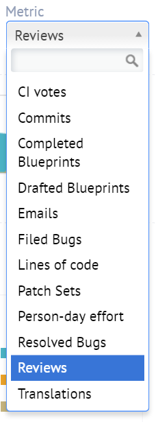
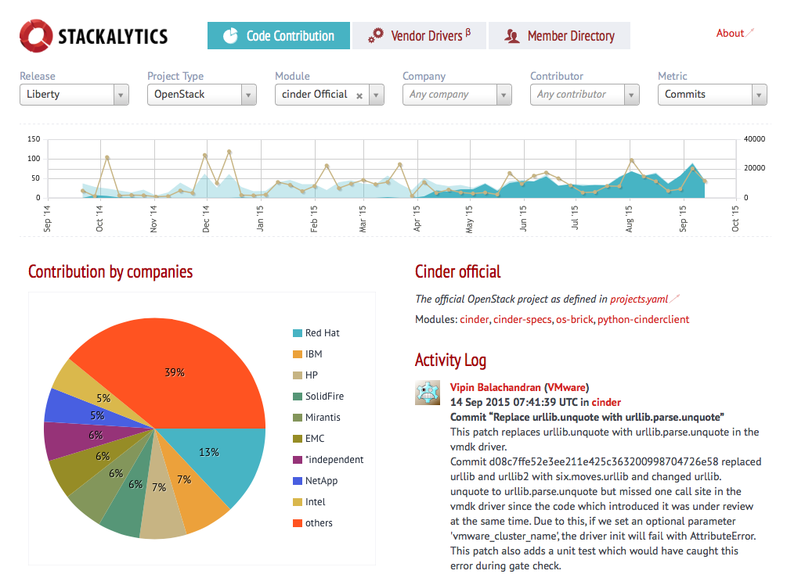
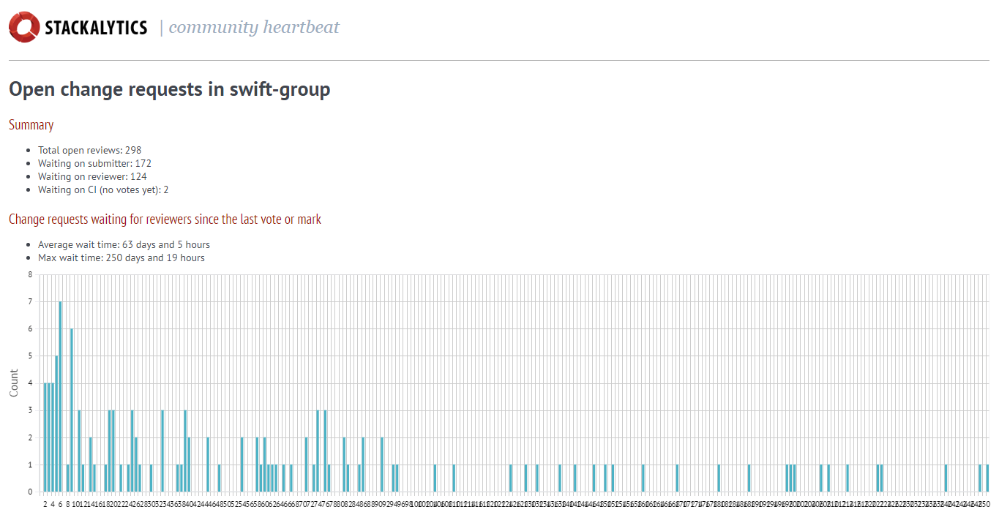

=======
Metrics
=======

.. image:: ./_assets/os_background.png
   :class: fill
   :width: 100%

The OpenStack Community in numbers
==================================

- Large and diverse community

  - 73,723 people
  - 660 supporting companies
  - 185 countries
  - More than 20 million lines of code

- Most recent ("Ocata") release stats:

  - 2,000 developers
  - 265 different organizations
  - More than 20,000 patches

Community metrics
=================

- Publicly available statistics about the community

  - Activity
  - Status
  - Progress

- The data can be collected and analyzed by anyone
- The metrics should be used within context

  - Don't game the numbers
  - Numbers should be used as an indication for competition

Stackalytics
============

- Provides transparent and meaningful statistics regarding contributions
  to both OpenStack itself and projects related to OpenStack

  - Transparency: the community can have confidence that all calculations
    are correct and fair
  - Meaningful: anyone may submit a correction that will adjust the influence
    of appropriate statistical data

- Collects and processes development activity data and makes it
  possible to visualize it in a convenient web dashboard

- http://stackalytics.com

 .. note::

  - Stackalytics Wiki: https://wiki.openstack.org/wiki/Stackalytics
  - There is a Forum session in Boston about the future of Stackalytics as
    there are issues with the tool. As we don't have a replacement as of now
    we can still share info about the currently available tool.

Relevant actors
===============

.. image:: ./_assets/02-01-relevant-actors.png
  :width: 100%

Available metrics
=================

Module - contributors
=====================

Exercise 1
==========
Look up the project you are most interested in and find the three most active
core reviewers (people that would be good to know for review help and getting
your patches merged).

Module - more views
===================

- Open reviews, contribution for the latest 30 or 90 days,
  activity report, etc.

Exercise 2
==========

For the cores you found earlier, figure out what time zone they
are probably in.
