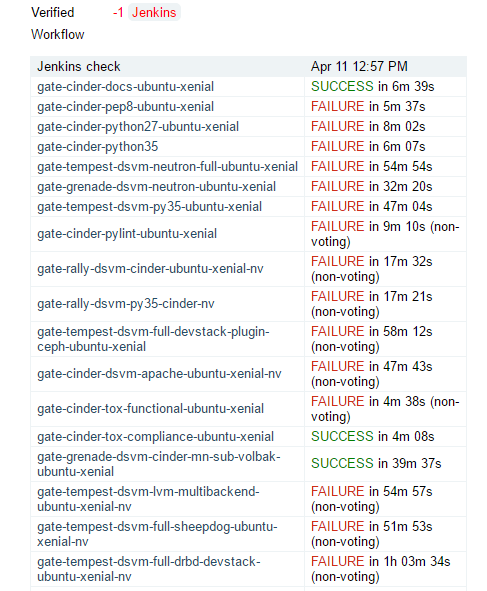

=================================
OpenStack Project Status and Zuul
=================================

.. image:: ./_assets/os_background.png
   :class: fill
   :width: 100%

OpenStack Infrastructure and Project Status
===========================================
- `http://status.openstack.org <http://status.openstack.org>`_

  - Zuul
  - Rechecks
  - Reviews
  - Bugday
  - OpenStack-Health

.. note::

  - Zuul is the project gating and automation system that tests and merges
    changes as well as publishing releases and documentation.
  - Rechecks has a list of bugs and associated information for
    nondeterministic check/gate failures.
  - Reviews has a list of important reviews based on blueprint and bug priority
    organized by project.
  - Bugday shows real-time stats during bug smash days.
  - OpenStack-Health has a dashboard of overal OpenStack test results.

Zuul
====

.. image:: ./_assets/workflow-project-status-and-zuul-zuul-page.png

Zuul Pipelines
==============
- Check

  - Run against all newly updated patch sets
  - Jenkins votes +1/-1 depending on test results

- Gate

  - Only run after a patch is approved by a core reviewer
  - More extensive testing than check pipeline
  - 'Gates' code entering the stable or master branches

- Post

  - Jobs run against a patch after it merges

Exercise
========
- Look at the `Zuul <http://status.openstack.org/zuul>`_ status page

  - Find the information that can be retrieved for each patch in a pipeline

    - What happens if you click on a patch under test

  - How many gate and check jobs are running
  - Pick your favorite project and report how many jobs it has running in IRC
  - What is the significance of the dots, lines and colors

- Discuss your findings with your group

Jenkins Failures
================

- Logs may be accessed by clicking on the test's name

Log Output
==========

.. image:: ./_assets/workflow-project-status-and-zuul-failure-log.png

Intermittent Failures
=====================
- Caused by timing/connectivity issues in check/gate
- May receive elastic recheck message
- List of `Rechecks <http://status.openstack.org/elastic-recheck>`_
- To trigger a re-run of check or gate add a comment to the patch
  in the form of 'recheck bug XXXXX'

Exercise
========
- Find how rechecks are categorized
- Discuss with your table how you would determine you encountered
  one of these bugs

