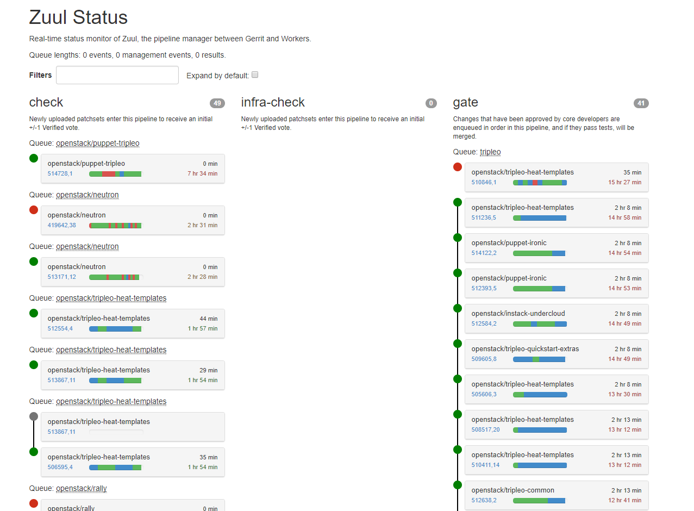
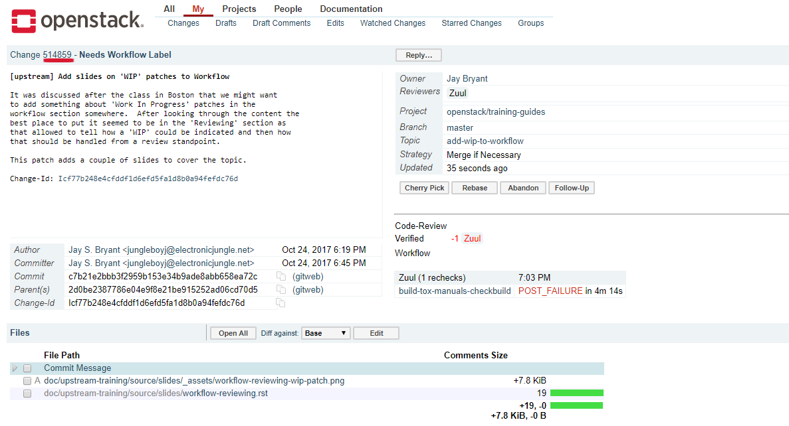
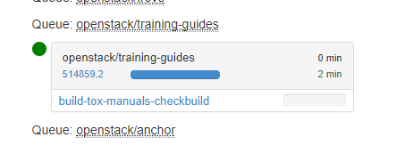
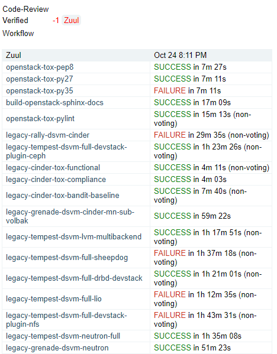
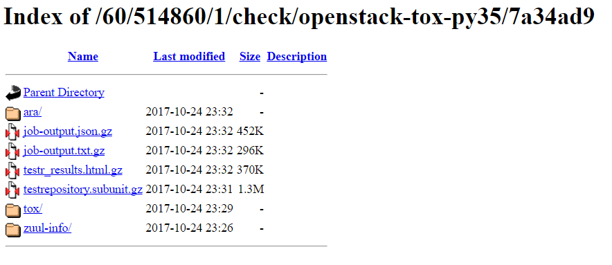
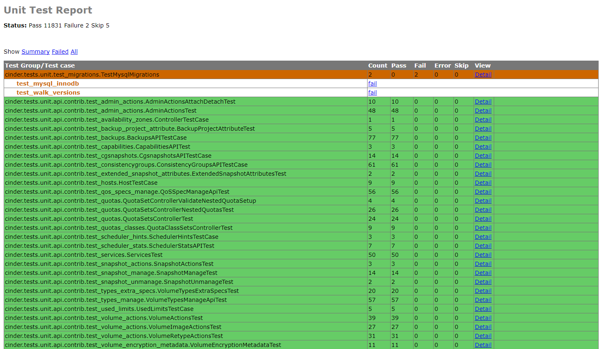
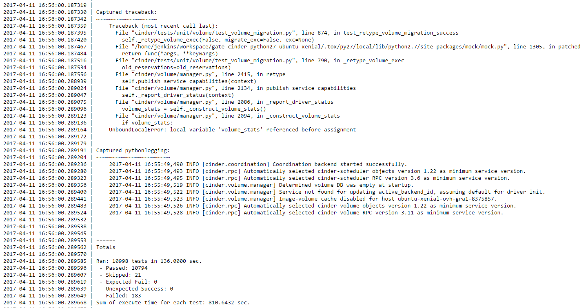
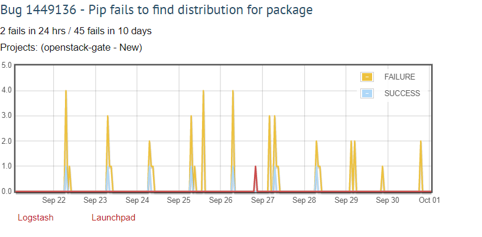

=================================
OpenStack Project Status and Zuul
=================================

.. image:: ./_assets/os_background.png
   :class: fill
   :width: 100%

.. note::
   Tags: [new_dev] [dev]

OpenStack Infrastructure and Project Status
===========================================
- `http://status.openstack.org <http://status.openstack.org>`_

  - Zuul
  - Rechecks
  - Reviews
  - Bugday
  - OpenStack-Health

.. note::

  - Zuul is the project gating and automation system that tests and merges
    changes as well as publishing releases and documentation.
  - Rechecks has a list of bugs and associated information for
    nondeterministic check/gate failures.
  - Reviews has a list of important reviews based on blueprint and bug priority
    organized by project.
  - Bugday shows real-time stats during bug smash days.
  - OpenStack-Health has a dashboard of overal OpenStack test results.

Zuul
====

Zuul Pipelines
==============
- Check

  - Run against all newly updated patch sets
  - Runs unit testing, Pep8, docs/releasenote build and
    functional tempest testing
  - Zuul votes +1/-1 depending on test results

- Gate

  - Only run after a patch is approved by a core reviewer
  - More extensive testing than check pipeline
  - Runs another unit test run along with additional tempest testing
  - 'Gates' code entering the stable or master branches

Zuul Pipelines - cont.
======================

- Post

  - Jobs run against a patch after it merges
  - Documentation build/publishing, tarball generation, image build

.. note::

  - The above jobs are examples of what is run in each pipeline.
    What is actually run varies based upon the project being tested.

Exercise
========
- Look at the `Zuul <http://status.openstack.org/zuul>`_ status page

  - Find the information that can be retrieved for each patch in a pipeline

    - What happens if you click on a patch under test

  - How many gate and check jobs are running
  - Pick your favorite project and report how many jobs it has running in IRC
  - What is the significance of the dots, lines and colors

- Discuss your findings with your group

Patch Number
============

.. note::

  - The number next to 'Change' is the patch number.
  - Can use the patch number to track status in Zuul status page.

Filtering on Patch Number in Zuul
=================================

.. note::

  - Shows the Zuul status page filtered down to just the patch of interest.

Zuul Failures
=============

Analysing Zuul Failures
=======================
- Logs may be accessed by clicking on the test's name

  - Directs the user to saved log output
  - Uses the browser to view the logs

- Voting and non-voting jobs

  - Voting job failures cause a -1 vote from Zuul on the patch
  - Non-voting jobs do not cause a -1 vote from Zuul upon failure

- Non-voting jobs are new jobs that are being tested and may not yet be ready
  to vote

Logs
====

.. note::

  - Example of what the logs for a run look like
  - Actual log files will vary depending on the test you are examining

Logs - Testr HTML Report
========================

Logs - Job Run Output
=====================

Intermittent Failures
=====================
- Caused by timing/connectivity issues in check/gate
- May receive elastic recheck message
- List of `Rechecks <http://status.openstack.org/elastic-recheck>`_
- To trigger a re-run of check or gate add a comment to the patch
  in the form of 'recheck bug XXXXX'

Recheck Example
===============

.. note::

  - Note ability to see logstash and link to launchpad

What Are Rechecks
=================

- Issues causing intermittent failures
- Elastic search is used to look for logs indicating similar failures

  - Users add new bugs to
    `elastic-recheck <https://docs.openstack.org/infra/elastic-recheck/readme.html>`_

- Goal is to capture all instances of a failure in the hopes of identifying
  patterns causing the bug
- Comments on patches that hit a known bug

Exercise
========
- Find how rechecks are categorized
- Discuss with your table how you would determine you encountered
  one of these bugs
