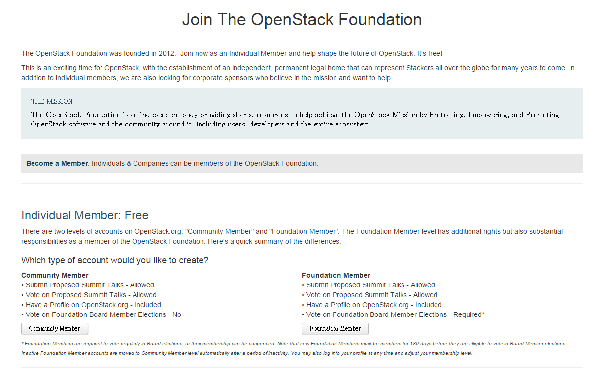
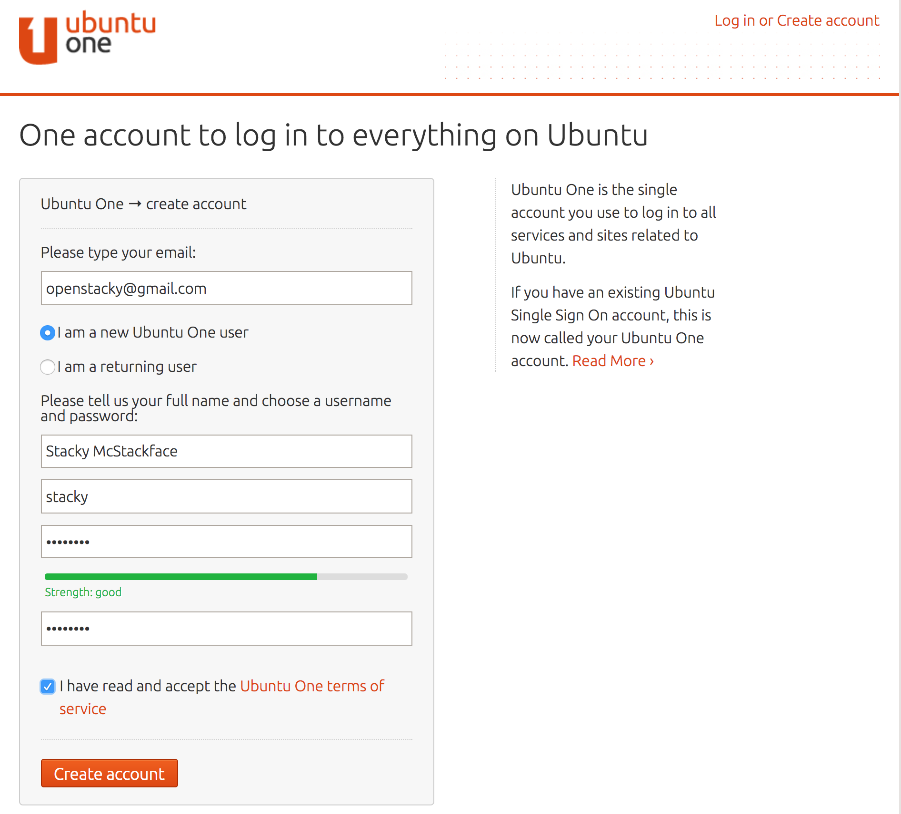
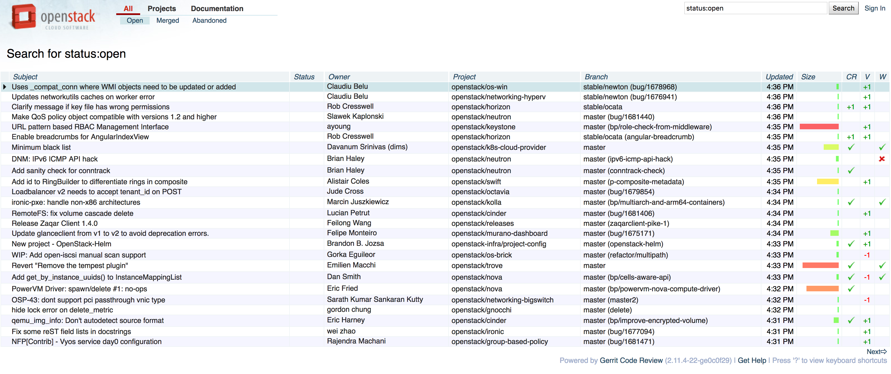
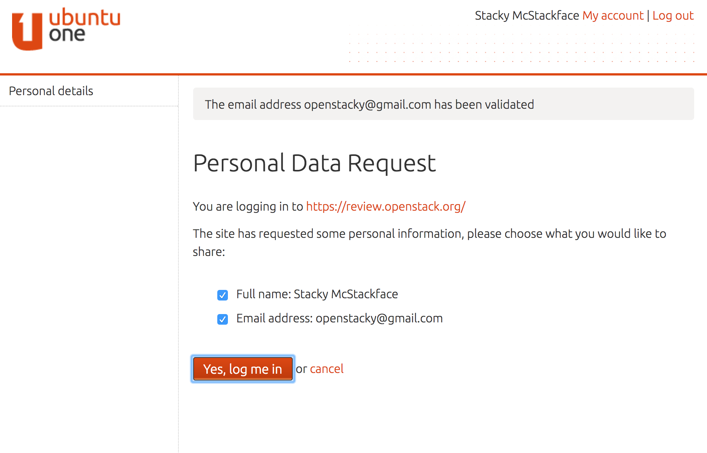
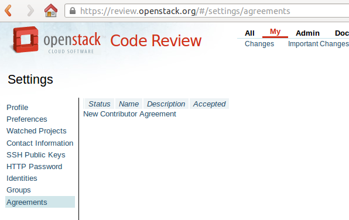
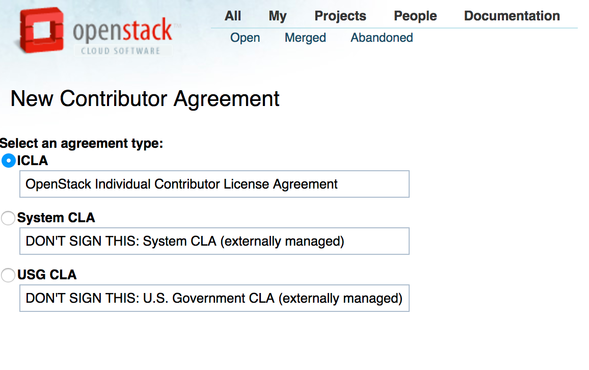
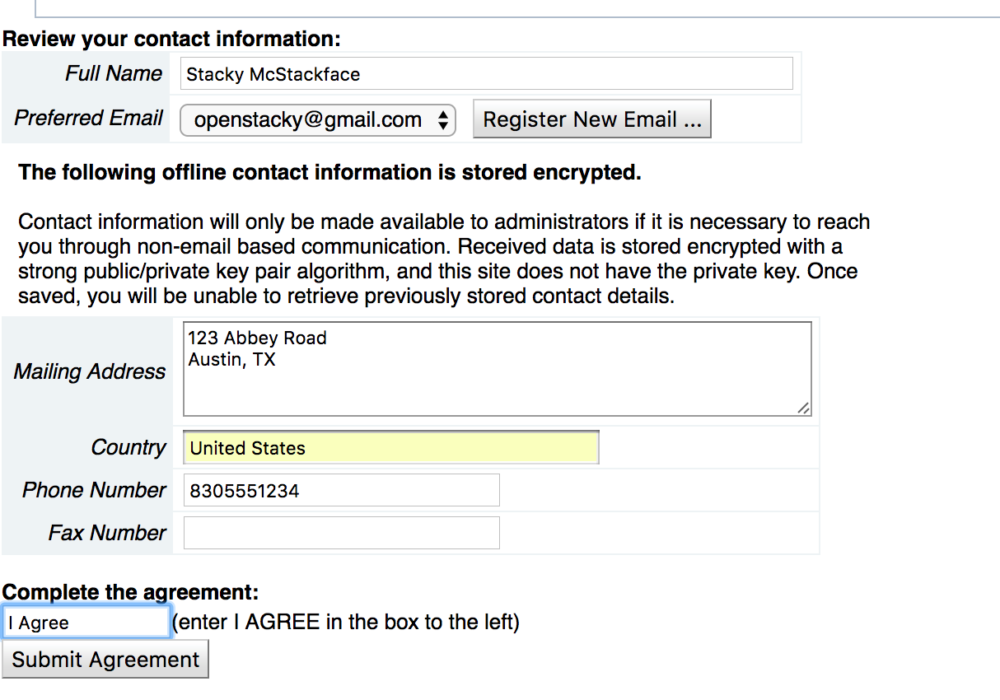
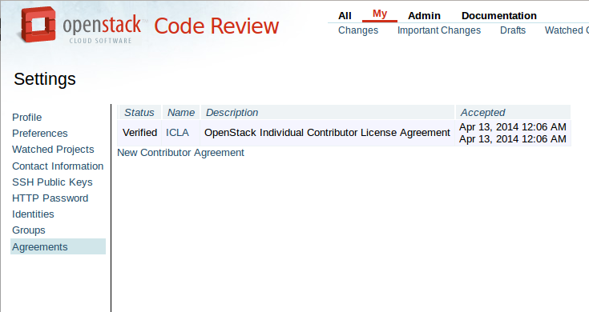

=========================
Registration and Accounts
=========================

.. image:: ./_assets/os_background.png
   :class: fill
   :width: 100%

Accounts
========

- OpenStack Foundation Account

  - elections (candidacy or vote), presentations

- Single sign-on OpenID

  - code review, bug tracking, blueprints, wiki

https://www.openstack.org/join/
===============================

Recommended to join, but not mandatory for code contributions

https://login.ubuntu.com
========================

http://review.openstack.org
===========================

Sign In
=======

No agreement
============

New agreement
=============

Sign the Individual agreement
=============================

Do you work at a company?
=========================

- If your contribution is on behalf of a company, have your managers sign the
  Corporate Contributor License Agreement
- When signing up for Foundation Membership, make sure to include the email
  address you’ll use for code contributions in one of the fields in your
  profile

- https://docs.openstack.org/infra/manual/developers.html#account-setup

Signed agreement
================

Exercise
========

Apply for individual membership (recommended), create a single sign-on
account and sign the ICLA
