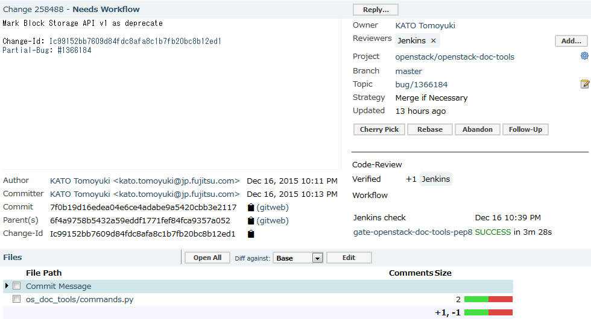
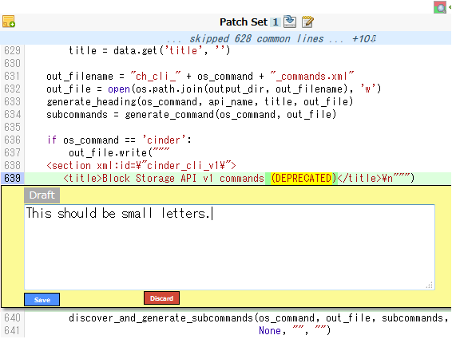
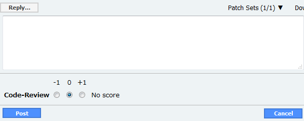
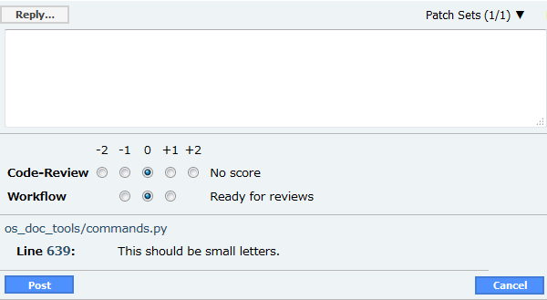
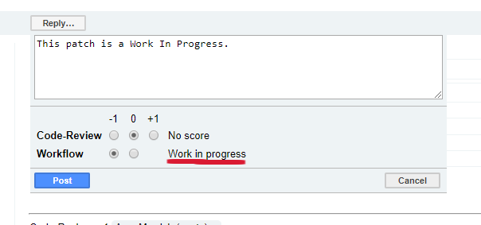

=========
Reviewing
=========

.. image:: ./_assets/os_background.png
   :class: fill
   :width: 100%

.. note::
   Tags: [new_dev] [dev]

Review unified
==============

Inline comments
===============

Draft inline comments
=====================

.. image:: ./_assets/16-04-draft-inline-comments.png
  :width: 100%

Regular reviewer
================

Core reviewer
=============

Exercise
========

Review three patches in the sandbox environment:

http://docs.openstack.org/upstream-training/workflow-using-sandbox.html

Try to find things to make comments on even if they
are just asking a question and not pointing out an
issue, don't just +1 three different patches.

Work In Progress Patches
========================

Work In Progress Patches
========================

- Multiple ways a patch can be indicated as a Work In Progress

  - 'Workflow' is set to '-1'
  - '[WIP]' is at the beginning of the patch's summary line

- Developers often do this to share an early preview of what they are
  doing or to allow for feedback during development
- Patches may be reviewed but should be done so with the fact that
  the patch is still being developed in mind

  - Don't -1 for spelling mistakes, wording or missing details
