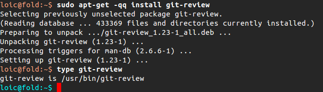
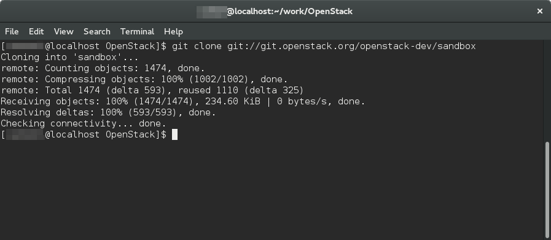
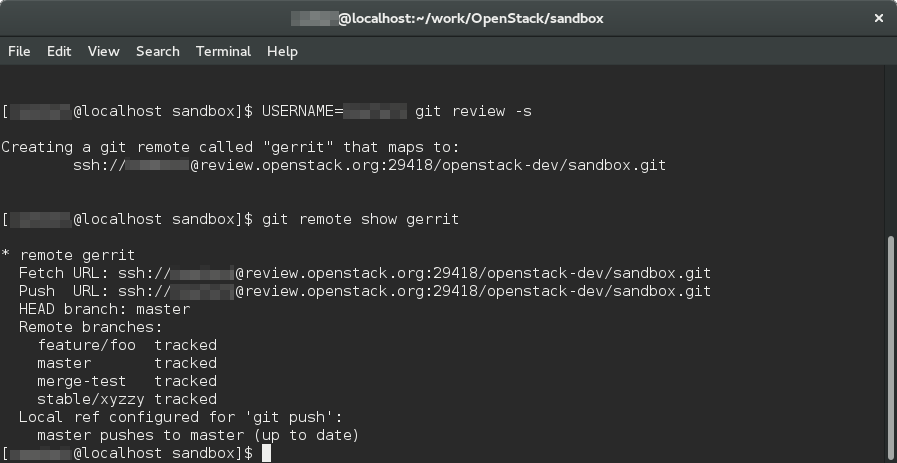
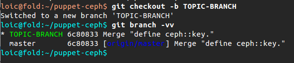
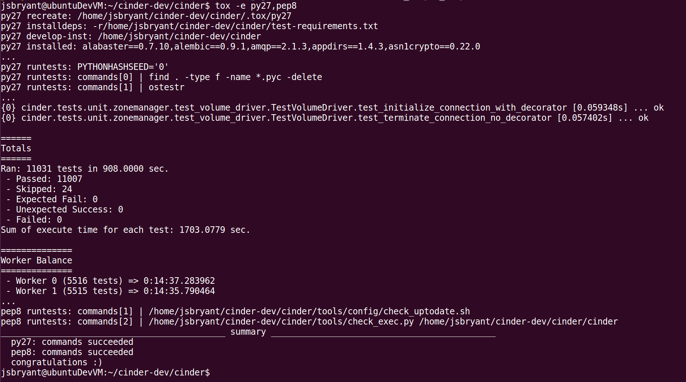
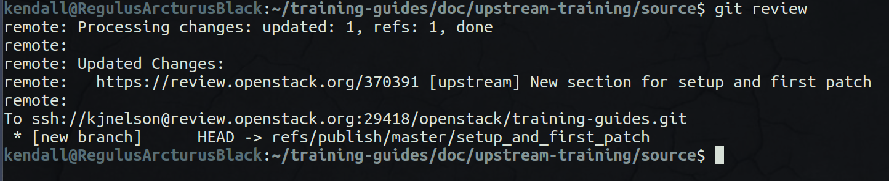

===================
Setup & First Patch
===================

.. image:: ./_assets/os_background.png
   :class: fill
   :width: 100%

git config
==========

- git config --global user.name "Firstname Lastname"
- git config --global user.email "your_email@youremail.com"

.. image:: ./_assets/14-04-git-config.png

Install git review
==================

- apt / yum / pip install … git review

git clone
=========

git review -s
=============

git checkout -b TOPIC-BRANCH
============================

running unit tests
==================

git commit --amend
==================

.. image:: ./_assets/14-13-git-commit-amend.png

git review
==========

Exercise
========
- Configure your workspace
    - git config
    - install git review
    - git clone
    - git review -s
- Create & push a Work in Progress (WIP) to the sandbox
    - git checkout -b <branch_name>
    - Run unit tests
    - Make changes
    - Run unit tests
    - Add files
    - Commit files and write commit message
    - git review
