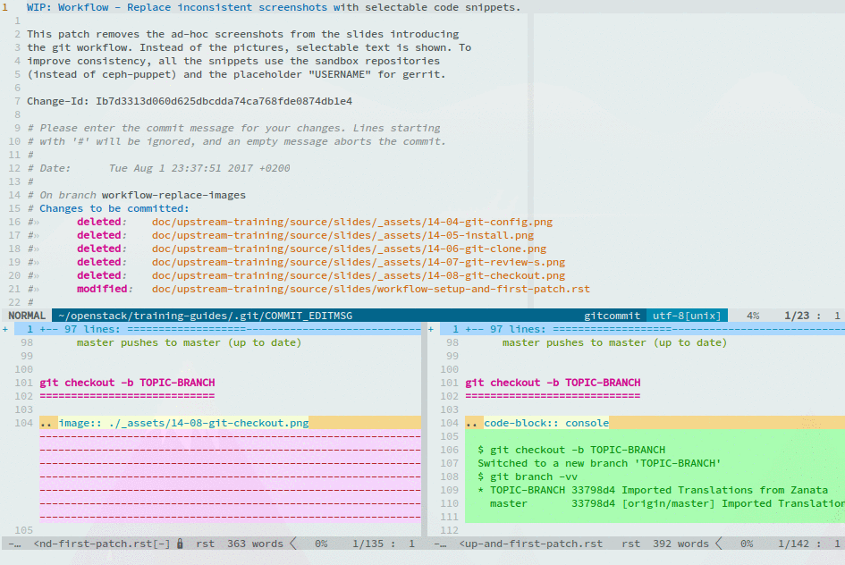

===================
Setup & First Patch
===================

.. image:: ./_assets/os_background.png
   :class: fill
   :width: 100%

git config
==========

.. code-block:: console

  $ git config --global user.name "Firstname Lastname"

  $ git config --global user.email "your_email@youremail.com"

  $ git config --list
  user.email=your_email@youremail.com
  user.name=Firstname Lastname
  core.repositoryformatversion=0
  core.filemode=true
  core.bare=false
  core.logallrefupdates=true
  remote.origin.url=https://git.openstack.org/openstack/training-guides
  remote.origin.fetch=+refs/heads/*:refs/remotes/origin/*
  branch.master.remote=origin
  branch.master.merge=refs/heads/master

Install git review
==================

- Use either your distribution's package manager (``apt``/``yum``) or ``pip``
  (recommended)

.. code-block:: console

  $ sudo -H pip install git-review
  Collecting git-review
    Downloading git_review-1.25.0-py2.py3-none-any.whl
  [ ... ]
  Installing collected packages: git-review
  Successfully installed git-review-1.25.0

git clone
=========

.. code-block:: console

  $ git clone git://git.openstack.org/openstack-dev/sandbox
  Cloning into 'sandbox'...
  remote: Counting objects: 1548, done.
  remote: Compressing objects: 100% (1049/1049), done.
  remote: Total 1548 (delta 598), reused 1178 (delta 340)
  Receiving objects: 100% (1548/1548), 254.74 KiB | 70.00 KiB/s, done.
  Resolving deltas: 100% (598/598), done.

  $ cd sandbox/

git review -s
=============

.. code-block:: console

  $ git review -s
  The authenticity of host '[104.130.246.91]:29418 ([104.130.246.91]:29418)' can't be established.
  RSA key fingerprint is SHA256:RXNl/GKyDaKiIQ93BoDvrNSKUPFvA1PNeAO9QiirYZU.
  Are you sure you want to continue connecting (yes/no)? yes
  Could not connect to gerrit.
  Enter your gerrit username: USERNAME
  Trying again with ssh://USERNAME@104.130.246.91:29418/openstack-dev/sandbox.git
  Creating a git remote called "gerrit" that maps to:
          ssh://USERNAME@104.130.246.91:29418/openstack-dev/sandbox.git

  This repository is now set up for use with git-review. You can set the
  default username for future repositories with:
    git config --global --add gitreview.username "USERNAME"

  $ git config --global --add gitreview.username "USERNAME"

git remote show gerrit
======================

.. code-block:: console

  $ git remote show gerrit
  * remote gerrit
    Fetch URL: ssh://USERNAME@104.130.246.91:29418/openstack-dev/sandbox.git
    Push  URL: ssh://USERNAME@104.130.246.91:29418/openstack-dev/sandbox.git
    HEAD branch: master
    Remote branches:
      feature/foo  tracked
      master       tracked
      merge-test   tracked
      stable/xyzzy tracked
    Local ref configured for 'git push':
      master pushes to master (up to date)

git checkout -b TOPIC-BRANCH
============================

.. code-block:: console

  $ git checkout -b TOPIC-BRANCH
  Switched to a new branch 'TOPIC-BRANCH'
  $ git branch -vv
  * TOPIC-BRANCH 33798d4 Imported Translations from Zanata
    master       33798d4 [origin/master] Imported Translations from Zanata

running unit tests
==================

.. code-block:: console

  $ tox -e py27,pep8
  [ ... ]
  ======
  Totals
  ======
  Ran: 11720 tests in 686.0000 sec.
   - Passed: 11712
   - Skipped: 8
   - Expected Fail: 0
   - Unexpected Success: 0
   - Failed: 0
  Sum of execute time for each test: 2382.5781 sec.

  ==============
  Worker Balance
  ==============
   - Worker 0 (2929 tests) => 0:09:59.085214
   - Worker 1 (2931 tests) => 0:10:51.072379
  [ ... ]

git commit --amend
==================

.. code-block:: console

  $ git commit --amend

.. note::
    Without going into details, mention and explain what kind of tools are
    available when it comes to diff, merge and edit commit messages in a
    real-world scenario.

    Worth mentioning:
      - git gui
      - gitk / gitg
      - tig
      - vim-fugitive, emacs-magit
      - other graphical stand-alone tools (sourcetree, tortoisegit)

git review
==========

.. code-block:: console

  $ git review
  remote: Processing changes: updated: 1, refs: 1, done
  remote: (W) f985de5: commit subject >65 characters; use shorter first paragraph
  remote:
  remote: Updated Changes:
  remote:   https://review.openstack.org/489760 WIP: Workflow - Replace inconsistent screenshots with selectable code snippets.
  remote:
  To ssh://review.openstack.org:29418/openstack/training-guides.git
   * [new branch]      HEAD -> refs/publish/master/workflow-replace-images

Exercise #1
===========

- Configure your workspace
    - ``git config``
    - install git review
    - ``git clone``
    - ``git review -s``
- Create & push a Work in Progress (WIP) to the sandbox
    - ``git checkout -b <branch_name>``
    - Make changes (add / edit files)
    - Commit files and write commit message
    - ``git review``
